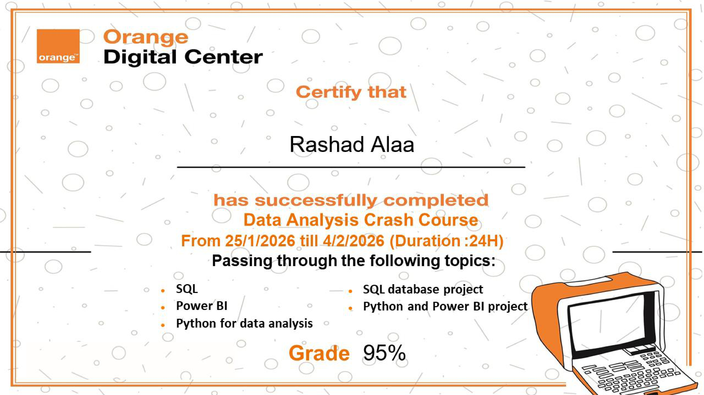

# 🍊 Orange Data Analytics Internship Projects

This repository showcases selected data analytics projects completed during the **Orange Data Analytics Training Program**.

  

The projects demonstrate hands-on experience with large-scale datasets, SQL analysis, Power BI dashboards, and business intelligence workflows. 

Through these projects, key business questions were answered, including:
- Sales performance optimization and profitability insights
- Customer behavior analysis and discount strategy
- Large-scale transactional analysis and system reliability assessment

Each project is presented as a separate repository, including all relevant data (or dataset links), dashboards, and SQL scripts for review.

This portfolio highlights the ability to translate raw data into actionable business insights using industry-standard tools and methods.

---

## 🛠 Tools & Technologies
- SQL (Advanced Queries, Data Modeling, Star Schema)
- Power BI (Dashboards, DAX, Data Visualization)
- Data Cleaning & Transformation
- Exploratory Data Analysis (EDA)
- Business Insight Development

---

## 📌 Projects Included

### 1️⃣ Superstore Sales Analytics (Power BI & SQL Server)
An end-to-end Business Intelligence project focused on sales performance optimization.

**Key Highlights:**
- Star Schema data modeling (Fact & Dimensions)
- SQL Server integration with Power BI
- Profitability & discount analysis
- Customer behavior insights
- Executive-level recommendations

📂 Repository:  
👉 [Superstore Sales Analytics](https://github.com/rashadalaa2000/superstore-powerbi-analytics)

---

### 2️⃣ Banking Transactions Analysis (SQL)
A high-volume transactional analysis processing **1 million banking records** to evaluate customer behavior and system reliability.

**Key Highlights:**
- Large-scale SQL-based analysis
- Exploratory Data Analysis (EDA)
- Time-series transaction analysis
- System stability & failure proxy detection
- Stress-point identification under peak load

📂 Repository:  
👉 [Banking Transactions Analysis](https://github.com/rashadalaa2000/Banking-Transaction-Analysis)

---

## 🎯 Key Takeaway
These projects demonstrate the ability to transform raw, large-scale data into actionable insights, combining technical execution with business-oriented thinking.

---

📌 **Note:** Both projects were completed as part of the **Orange Data Analytics Training Program**.
